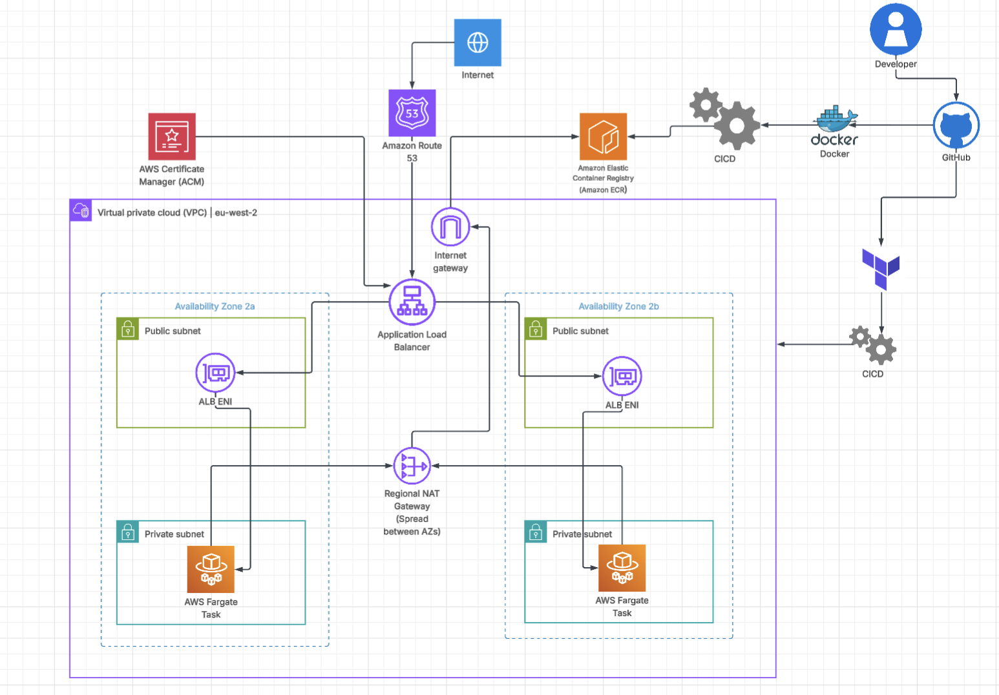
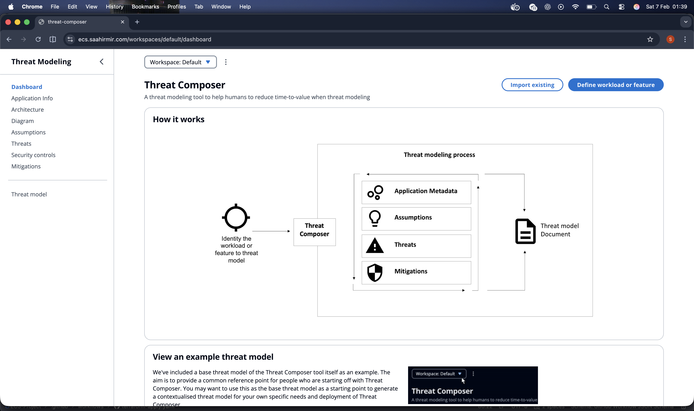

# AWS Threat Composer App Hosted on ECS with Terraform

<!-- Project badges -->


## Contents
- [Overview of the setup](#overview-of-the-setup)
- [Architecture Diagram](#architecture-diagram)
- [Repository Structure](#repository-structure)
- [Local App Set-up](#local-app-set-up)
- [Dockerfile Explained](#dockerfile-explained)
- [Run locally with Docker (build + run + health check)](#run-locally-with-docker-build--run--health-check)
- [Infrastructure (AWS)](#infrastructure-aws)
- [Terraform approach (best-practice structure)](#terraform-approach-best-practice-structure)
- [CI/CD (GitHub Actions)](#cicd-github-actions)
- [Security scanning](#security-scanning)
- [Shift-left security (pre-commit)](#shift-left-security-pre-commit)
- [Proof of application working](#proof-of-application-working)
- [Successful Pipeline Runs](#successful-pipeline-runs)
- [Learning and Reflections](#learning-and-reflections)

## Overview of the setup

This project is based on Amazon's Threat Composer Tool, an open source tool designed to facilitate threat modeling and improve security assessments.
You can explore the tool's dashboard here: [Threat Composer Tool](https://awslabs.github.io/threat-composer/workspaces/default/dashboard)


## Architecture Diagram:


## Repository Structure
```text
├── .gitignore
├── .dockerignore
├── .checkov.yaml
├── .pre-commit-config.yaml
├── .trivyignore
├── .github
│   └── workflows
│       ├── docker-image.yaml
│       ├── health_check.yaml
│       ├── terraform-apply.yaml
│       └── terraform-destroy.yaml
├── s3_bootstrap
├── ecr_bootstrap
├── app
├── images
├── Dockerfile
├── docker-file-old
├── README.md
└── infra
    ├── main.tf
    ├── modules
    │   ├── acm
    │   ├── alb
    │   ├── ecs
    │   ├── sg
    │   └── vpc
    ├── outputs.tf
    ├── provider.tf
    └── variables.tf
```

## Local App Set-up:
1. Clone app
2. cd to /app


Do the following commands in terminal:
```bash
yarn install
yarn build
yarn global add serve
serve -s build
```
Enter into your browser:
```text
http://localhost:3000
```

## Dockerfile Explained:
```
ARG NODE_VERSION=24.7.0-alpine
ARG NGINX_VERSION=alpine3.23

# Building Stage
FROM node:${NODE_VERSION} AS builder

# Setting Work Dir
WORKDIR /app

# Copying only the package.json + yarn.lock  - this layer is unlikely to change as much
# Hence we copy this first to benefit from layer caching
COPY /app/package.json /app/yarn.lock ./

RUN yarn install --frozen-lockfile # using frozen-lockfile to make sure that versioning is consistent

# Copy the rest of the project files over
COPY /app .

# Build application
RUN yarn build

# Runner Stage
FROM nginxinc/nginx-unprivileged:${NGINX_VERSION} AS runner

# Use a built-in non-root user for security best practices
USER nginx

# Copy custom Nginx config (with /health check)
COPY /app/nginx/nginx.conf /etc/nginx/nginx.conf

# Copy the static build output from the build stage to Nginx's default HTML serving directory
# (reducing file size as we don't unnecessary files)
COPY --chown=nginx:nginx --from=builder /app/build /usr/share/nginx/html

# Expose port 8080 to allow HTTP traffic
# Note: The default NGINX container now listens on port 8080 instead of 80
EXPOSE 8080

# Start Nginx directly with custom config
ENTRYPOINT ["nginx", "-c", "/etc/nginx/nginx.conf"]
CMD ["-g", "daemon off;"]

```
## Run locally with Docker (build + run + health check)
From the repo root (where the Dockerfile lives):
```
# 1) Build the image
docker build -t threat-composer:local .

# 2) Run the container (maps host 8080 -> container 8080)
docker run --rm --name threat-composer -p 8080:8080 threat-composer:local

# (optional) run in detached mode instead:
# docker run -d --rm --name threat-composer -p 8080:8080 threat-composer:local
```
To do a health check, run the following command:
```
curl -i http://localhost:8080/health
# or just:
curl http://localhost:8080/health
```
You can stop the container with:
```
docker stop threat-composer
```

### Infrastructure (AWS)
- **Region + AZs**: Deployed in **eu-west-2** across **two Availability Zones** for resilience.
- **Networking (VPC)**: Dedicated VPC with **public** and **private** subnets.
- **Ingress (ALB)**: An **internet-facing Application Load Balancer** sits in the public subnets and is the only public entry point.
- **Compute (ECS Fargate)**: An **ECS Fargate Service** runs the container in private subnets using **`awsvpc`** networking (each task gets its own ENI/IP).
- **Routing**: ALB listener forwards traffic to an **ALB Target Group** (target type `ip`) which registers the ECS tasks.
- **DNS + TLS**:
    - **Route 53** hosts the domain and uses an **Alias A record** (`ecs.saahirmir.com`) to point to the ALB.
    - **ACM** provides the TLS certificate used by the ALB **HTTPS (443)** listener.
- **Egress (private)**: Private subnet egress is handled via a **Regional NAT Gateway** (where required) so tasks can reach the internet without being publicly addressable ie to ECR.
- **Security groups (least privilege)**:
    - ALB SG allows inbound **443** from the internet. (**Port 80 used to allow redirect to 443 for ALB Listener Rule**)
    - Task SG only allows inbound on the app port **from the ALB SG** (no direct public access).

### Terraform approach (best-practice structure)
- **Modular design**: Infrastructure is broken into focused modules: `vpc`, `sg`, `alb`, `acm`, `ecs`.
- **Clear interfaces**: Module inputs/outputs are wired in `infra/main.tf`, keeping concerns separated and reusable.

### CI/CD (GitHub Actions)
- **OIDC to AWS (no long-lived keys)**: Workflows authenticate to AWS using **GitHub Actions OIDC** and `aws-actions/configure-aws-credentials`, assuming an IAM role with short-lived credentials (instead of storing AWS access keys in GitHub secrets).
    - GitHub OIDC docs: https://docs.github.com/actions/deployment/security-hardening-your-deployments/configuring-openid-connect-in-amazon-web-services
    - AWS credentials action: https://github.com/aws-actions/configure-aws-credentials
- **Repo variables for configuration**: Non-sensitive settings (e.g. account/region/image tag names) are stored as **GitHub repository variables**, keeping workflows clean and avoiding hard-coded values.
- **Pipeline gating (approvals)**: Terraform **apply** / **destroy** stages are protected by environment rules so deployments require approval before running.
    - Environments + protection rules: https://docs.github.com/actions/deployment/targeting-different-environments/using-environments-for-deployment
- **Concurrency control**: Deployment workflows use **concurrency** to prevent overlapping applies/destroys and reduce the risk of state conflicts.
    - Concurrency docs: https://docs.github.com/actions/writing-workflows/choosing-what-your-workflow-does/control-the-concurrency-of-workflows-and-jobs

### Security scanning
- **Container image scanning**: Trivy scans are run during image publishing to catch vulnerabilities before pushing/deploying.
    - Trivy GitHub Action: https://github.com/aquasecurity/trivy-action
- **Terraform / IaC scanning**: Trivy is also used for **IaC misconfiguration scanning** of Terraform before deployment.
    - Trivy Terraform scanning: https://trivy.dev/docs/v0.50/tutorials/misconfiguration/terraform/

### Shift-left security (pre-commit)

This repo uses the **pre-commit** framework to run security and quality checks locally before changes land in Git, so misconfigurations 
and risky patterns are caught early instead of during terraform apply. 

Hooks include Terraform formatting and Terraform-focused scanners 
**(via pre-commit-terraform)**, plus **Checkov** and **Trivy** misconfiguration scanning for **Terraform/IaC;** supporting hygiene checks like 
**YAML formatting** and **workflow/Docker linting** help keep CI and container build files clean as well.

## Proof of application working
URL used: ecs.saahirmir.com


## Successful Pipeline Runs:
### Docker Image Publish

### Terraform Plan + Apply

### Terraform Plan + Destroy

### Domain URL Health Check


## Learning and Reflections

The biggest takeaway from this project was that most “it doesn’t work” moments came down to **networking fundamentals**. 

I learned to slow down and systematically verify the full request path end-to-end: **Route53 -> ALB listener rules -> 
target group health checks -> ECS task networking (subnets/routes) -> security groups (inbound + outbound)**. 

Small mismatches (ports, health check paths, SG references, route tables) can look like an application issue when it’s 
actually just traffic not flowing where you think it is.

On the process side, I reinforced the importance of **staying consistent** and not trying to solve everything in 
one jump. Breaking problems into smaller checks, asking for help when stuck, and avoiding overthinking made the biggest 
difference in getting from “provisioned” to “actually reachable and stable.” 

I also gained appreciation for building in guardrails early (CI gating/approvals, concurrency control, and pre-commit scanning) 
so mistakes can be caught quickly before they become expensive or time-consuming to debug.
